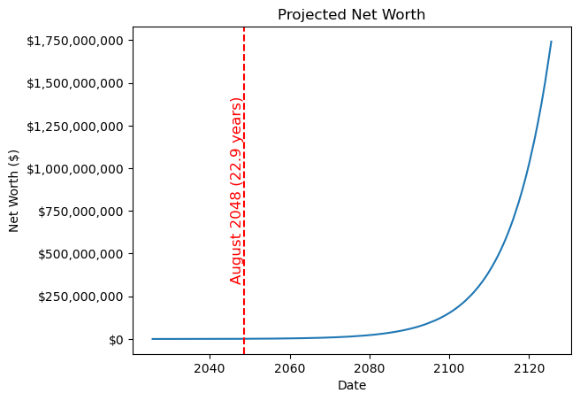

# Net Worth Projector

This project provides a tool to help you project your net worth growth over
time. Using a [Jupyter Notebook](https://jupyter.org), you can model how your
net worth evolves based on factors such as income, interest rates, and expenses.
The notebook generates visualizations to help you plan and achieve specific
financial goals such as becoming a millionaire or becoming financially
independent.

## Example

Imagine someone with the following financial parameters:

- **Starting Net Worth:** $1,000  
- **Monthly Income (after taxes):** $5,000  
- **Monthly Expenses:** $4,000  
- **Annual Interest Rate on Savings/Investments:** 10%

Using these parameters, the tool calculates how their net worth evolves over
time. Here's a chart illustrating the growth of their net worth:

In this scenario, it would take approximately **22.9 years** for the individual
to achieve a net worth of $1 million. The visualization helps highlight the
impact of consistent savings, investment returns, and time on reaching financial
milestones.

## Getting Started

1. **Open the Notebook:**  
   Open the [`Net_Worth_Projector.ipynb`](Net_Worth_Projector.ipynb) file in
   [JupyterLab](https://jupyter.org) or
   [Visual Studio Code](https://code.visualstudio.com)  with the
   [Jupyter extension](https://marketplace.visualstudio.com/items?itemName=ms-toolsai.jupyter)
   installed.
2. **Set Your Parameters:**  
   Set your starting net worth, monthly income, monthly expenses, expected
   interest rate, and financial goal directly in the notebook cells.
3. **Run the Notebook:**  
   Execute the cells in the notebook to calculate your net worth projection and
   generate a visualization based to your inputs.
4. **Analyze the Results:**  
   Review the generated chart and adjust parameters to understand how your
   financial decisions impact your net worth over time.

## License

This project is licensed under the [MIT License](LICENSE).
